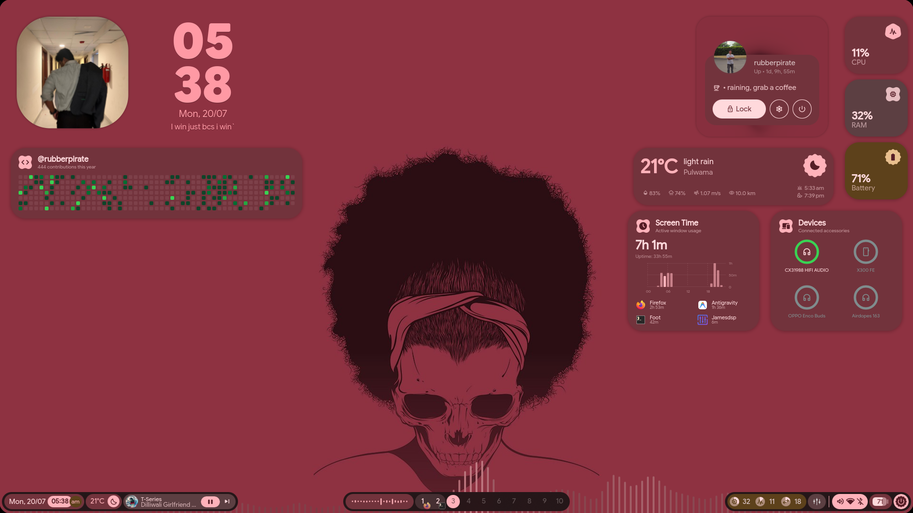
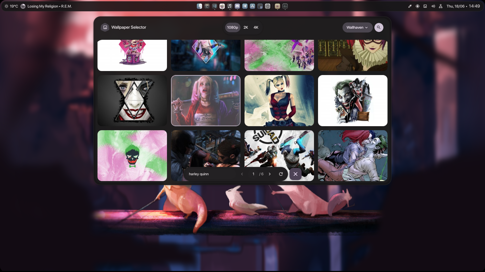

<div align="center">

# 💠 end4-pC

**A personal fork of [illogical-impulse](https://github.com/end-4/dots-hyprland) by [@end-4](https://github.com/end-4)**  
Customized and maintained by **pctrade**

</div>

---

## 📸 Screenshots
<div align="center">

| 🎵 Lyrics | 🖼️ Online Wallpapers |
|:---:|:---:|
|  |  |
| 🪟 Desktop Widgets | 🔧 Hyprland Configs |
|  |  |
| ⚙️ Configurable Bar | ✨ And More |
|  |  |

</div>

---

## ⚡ Installation

> [!NOTE]
> This fork manages its own configuration folder independently — it does **not** overwrite or modify any existing setup. However, it does require [illogical-impulse](https://github.com/end-4/dots-hyprland) to be installed and running.

```bash
cd ~/.config/quickshell/
git clone https://github.com/pctrade/end4-pC.git
killall qs 2>/dev/null; qs -c end4-pC > /dev/null 2>&1 & disown
```

---

## 🙏 Credits

Huge thanks to the people who made this possible:

- **[@end-4](https://github.com/end-4)** — for creating the original [dots-hyprland](https://github.com/end-4/dots-hyprland) / illogical-impulse shell. An absolute masterpiece of a dotfiles project 🫡
- **[@gh0stzk](https://github.com/gh0stzk)** — for providing the weather API integration that made the weather widget possible 🙌

---

<div align="center">

Made with ❤️ — feel free to fork and make it your own

</div>
